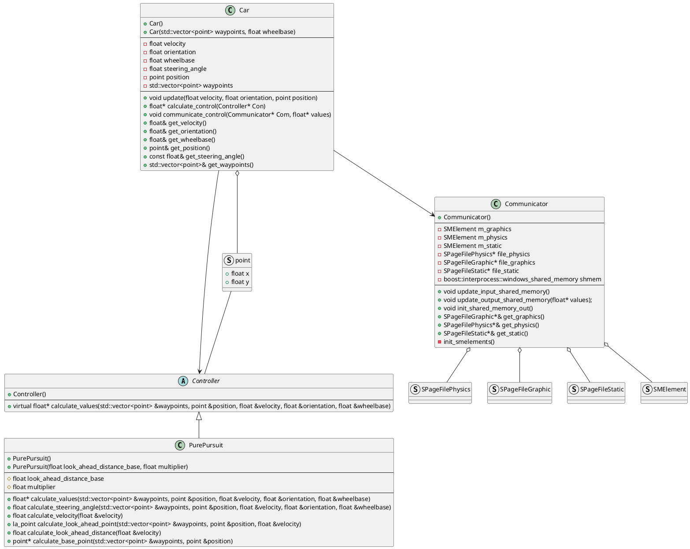

```plantuml
@startuml
abstract Controller
{
    + Controller()
    --
    + virtual float* calculate_values(std::vector<point> &waypoints, point &position, float &velocity, float &orientation, float &wheelbase)
}

class PurePursuit
{
    + PurePursuit()
    + PurePursuit(float look_ahead_distance_base, float multiplier)
    --
    # float look_ahead_distance_base
    # float multiplier
    --
    + float* calculate_values(std::vector<point> &waypoints, point &position, float &velocity, float &orientation, float &wheelbase)
    + float calculate_steering_angle(std::vector<point> &waypoints, point &position, float &velocity, float &orientation, float &wheelbase)
    + float calculate_velocity(float &velocity)
    + la_point calculate_look_ahead_point(std::vector<point> &waypoints, point &position, float &velocity)
    + float calculate_look_ahead_distance(float &velocity)
    + point* calculate_base_point(std::vector<point> &waypoints, point &position)
}

class Car
{
    + Car()
    + Car(std::vector<point> waypoints, float wheelbase)
    --
    - float velocity
    - float orientation
    - float wheelbase
    - float steering_angle
    - point position
    - std::vector<point> waypoints
    --
    + void update(float velocity, float orientation, point position)
    + float* calculate_control(Controller* Con)
    + void communicate_control(Communicator* Com, float* values)
    + float& get_velocity()
    + float& get_orientation()
    + float& get_wheelbase()
    + point& get_position()
    + const float& get_steering_angle()
    + std::vector<point>& get_waypoints()
}

class Communicator
{
    + Communicator()
    --
    - SMElement m_graphics
    - SMElement m_physics
    - SMElement m_static
    - SPageFilePhysics* file_physics
    - SPageFileGraphic* file_graphics
    - SPageFileStatic* file_static
    - boost::interprocess::windows_shared_memory shmem
    --
    + void update_input_shared_memory()
    + void update_output_shared_memory(float* values);
    + void init_shared_memory_out()
    + SPageFileGraphic*& get_graphics()
    + SPageFilePhysics*& get_physics()
    + SPageFileStatic*& get_static()
    - init_smelements()
}

struct point
{
    + float x
    + float y
}

struct SPageFilePhysics
struct SPageFileGraphic
struct SPageFileStatic
struct SMElement

Controller <|-- PurePursuit

Car o-- point

Car --> Communicator
Car --> Controller

point -- Controller

Communicator o-- SPageFilePhysics
Communicator o-- SPageFileGraphic
Communicator o-- SPageFileStatic
Communicator o-- SMElement

@enduml
```